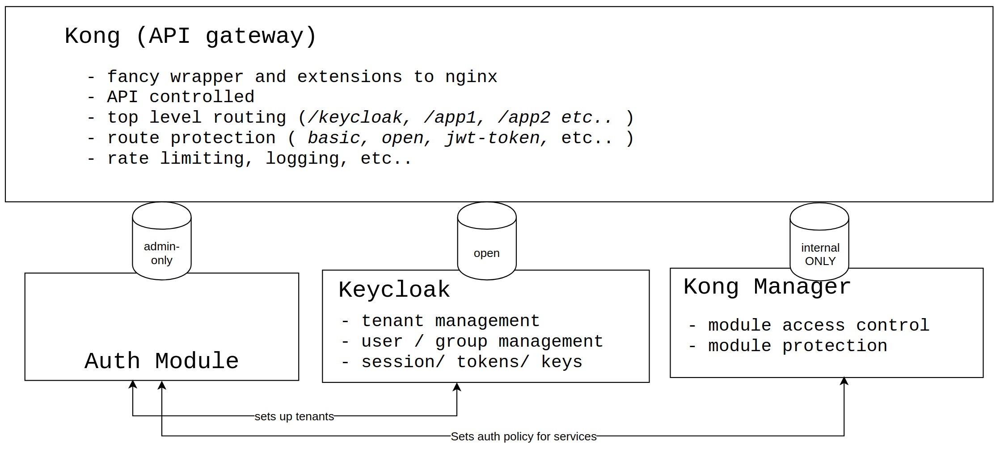
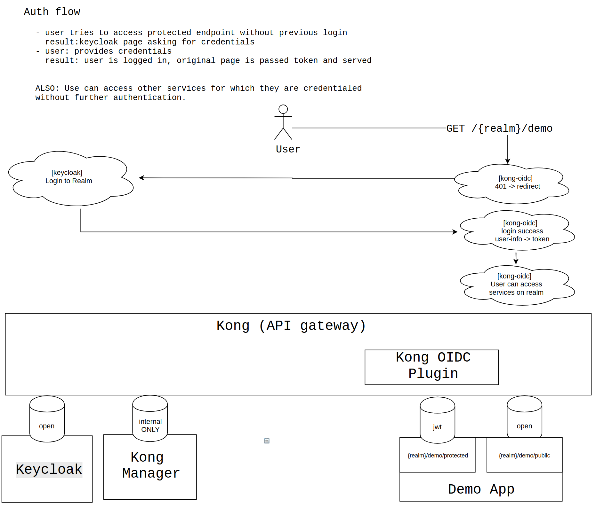

## Authentication & Routing Demo

In order to reliably implement multitenancy in a variety of solutions with flexible configurations, we needed some common components. This repository demonstrates how Keycloak and Kong can be used to protect microservices in a MT environment, supporting an arbitrary number of tenants and services, with different combinations of services per tenant.

#### Contents
 - Component Diagram
 - User Flow Diagram
 - Walkthrough
 - Extending

### Components

### User Flow

### Walkthrough

 - Add `floramedia.local` to your `/etc/hosts` file as an alias to localhost.
   -  (cookies don't like to use localhost, and we use them extensively)
 - Run `scripts/setup_auth.sh`
 - Once complete, `run scripts/start.sh` to start services
 - One complete, you can visit http://floramedia.local/keycloak/auth/
   - Administrative KC user is : `admin`:`password`
   - This user can modify all realms (dev, prod, master) from the master realm.
 - Start the demo service will be running: you can watch logs at `docker-compose logs -f demo-service`
 - Visit http://floramedia.local/dev/demo/public/my-page to access an unprotected page
 - Visit http://floramedia.local/dev/demo/protected/user to access a protected page
   - User `user`: `password`
   - See that:
     - `{"error": "user lacks one any of the following roles: ['user', 'admin']"}`
     - The user is logged in, but lacks one of the proper role to access this page.
 - We can add the role `user` to the Dev realm.
   - [Visit the "Dev" roles page](http://floramedia.local/keycloak/auth/admin/master/console/#/realms/dev/roles)
   - Select `Add Role`
   - Add a role called `user`
   - [Visit the "Dev" users page](http://floramedia.local/keycloak/auth/admin/master/console/#/realms/dev/users)
   - Select `View All Users`
   - Edit the user with username `user`
   - Under the Role Mappings tab, add the role `user` from `Available Roles`
   - Refresh the page we were you were trying to access : http://floramedia.local/dev/demo/protected/user

 - Visit http://floramedia.local/dev/demo/protected/admin to access another protected page
   - Notice that the service returns a 401: `{"error": "user lacks one any of the following roles: ['admin']"}`
   - Adding the role `admin` to the user will allow access. 

 - Logout from `user` by visiting: http://floramedia.local/dev/demo/logout
 - Visit the demo service on realm prod: http://floramedia.local/prod/demo/
 - This is a different realm, with a different set of users. There is a user named `user` here, but it's not the same one we used earlier.
 
You can then log in and out of the two realms, and be allowed or denied based on the policy. Changes made it the keycloak administrative interface (like giving `user` the role `admin`) will take up to 60 seconds for the services to pick up, based on the Kong-OIDC plugin caching policy.

### Extension

  - Realms are created in this demo by calling the `create_kc_user` from `scripts/floramedia_functions.sh`
  - Available services are currently defined by json documents found in `/api-auth/service`
  - Sets of services can be combined for easy installation in `/api-auth/solution`

Addind a valid artifact to either of those two and running setup will make it available. In the case of a service, you need to enable it by name for the realm in question using the `docker-compose run auth add_service {service} {realm}` command.

Any service you want to proxy must be available from inside docker at the url provided. I.E if you're trying to proxy something across docker-compose networks, take that into account.

   
 
Gotchas: 

Remove port 80 occup. sudo launchctl unload -w /System/Library/LaunchDaemons/org.apache.httpd.plist